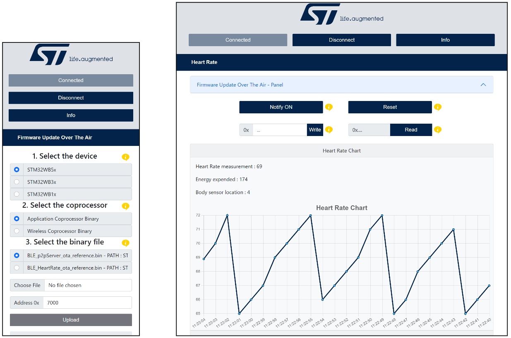
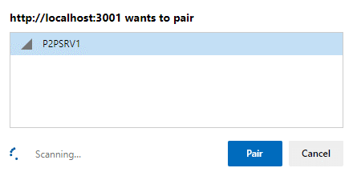
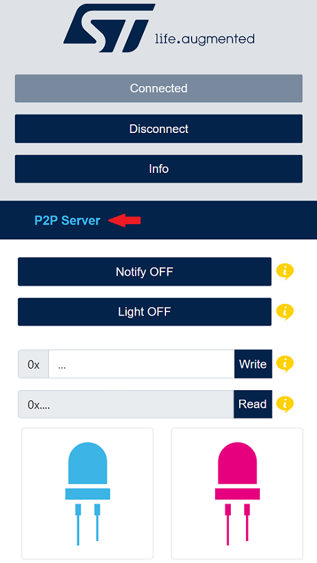
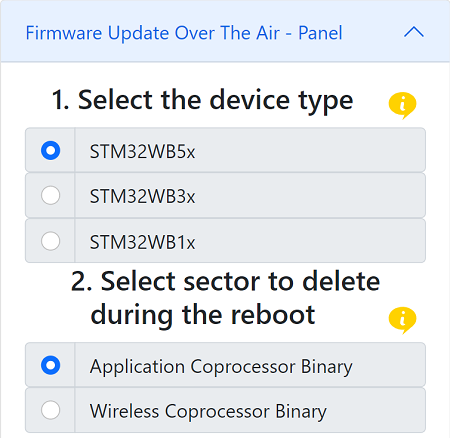
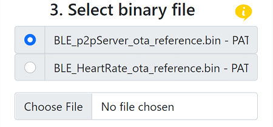
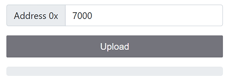
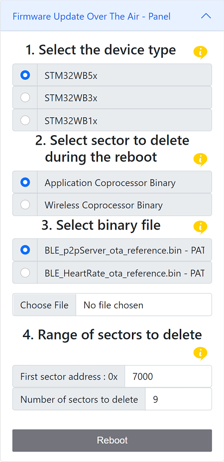
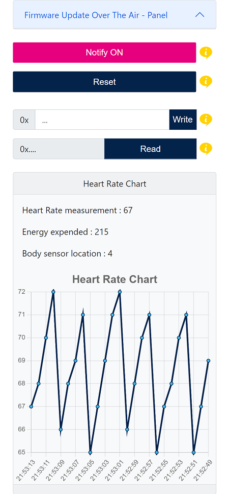
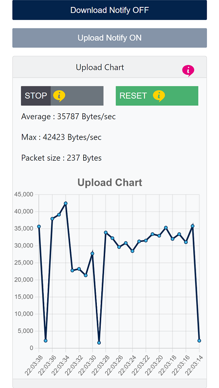

# **STM32WB Web Bluetooth® App Interfaces**

# **Introduction**

This is a web interface created with [React 18](https://reactjs.org/ "https://reactjs.org/") and [Bootstrap 5](https://getbootstrap.com/ "https://getbootstrap.com/").  
This web interface using Web Bluetooth® APIs can be used to establish a Bluetooth® LE connection and exchange data with a STM32WB board

STM32WB firmware applications that could be downloaded to interact with Web Bluetooth application:  

-	P2Pserver
-	[HeartRate](https://wiki.st.com/stm32mcu/wiki/Connectivity:STM32WB_HeartRate "https://wiki.st.com/stm32mcu/wiki/Connectivity:STM32WB_HeartRate")
-	Firmware Update Over The Air
-	Data Throughput

Example of the interface when a connection is established with Firmware Update Over The Air application and HeartRate application

***

# **Setup**

The following [wiki page](https://wiki.st.com/stm32mcu/wiki/Connectivity:STM32WB_BLE_Hardware_Setup "https://wiki.st.com/stm32mcu/wiki/Connectivity:STM32WB_BLE_Hardware_Setup") will help you to put in place the hardware setup.

## Hardware requirements

To use the web interface, one of the following **STM32WB** boards is necessary .
- [P-NUCLEO-WB55](https://www.st.com/en/evaluation-tools/p-nucleo-wb55.html "https://www.st.com/en/evaluation-tools/p-nucleo-wb55.html")
- [NUCLEO-WB15CC](https://www.st.com/en/evaluation-tools/nucleo-wb15cc.html "https://www.st.com/en/evaluation-tools/nucleo-wb15cc.html")
- [STM32WB5MM-DK](https://www.st.com/en/evaluation-tools/stm32wb5mm-dk.html "https://www.st.com/en/evaluation-tools/stm32wb5mm-dk.html")  

A PC or a smartphone is required to open the web interface in a browser.

## Software requirements

Flash [stm32wb5x_BLE_Stack_full_fw.bin](https://github.com/STMicroelectronics/STM32CubeWB/blob/398d0fbc5ef491da30f777575b911e50e68fa77f/Projects/STM32WB_Copro_Wireless_Binaries/STM32WB5x/stm32wb5x_BLE_Stack_full_fw.bin?raw=true "https://github.com/STMicroelectronics/STM32CubeWB/blob/398d0fbc5ef491da30f777575b911e50e68fa77f/Projects/STM32WB_Copro_Wireless_Binaries/STM32WB5x/stm32wb5x_BLE_Stack_full_fw.bin?raw=true") or [stm32wb5x_BLE_Stack_light_fw.bin](https://github.com/STMicroelectronics/STM32CubeWB/blob/master/Projects/STM32WB_Copro_Wireless_Binaries/STM32WB5x/stm32wb5x_BLE_Stack_light_fw.bin?raw=true "https://github.com/STMicroelectronics/STM32CubeWB/blob/master/Projects/STM32WB_Copro_Wireless_Binaries/STM32WB5x/stm32wb5x_BLE_Stack_light_fw.bin?raw=true") binary  on the Wireless Coprocessor.  
If it is not the case, **STM32CubeProgrammer** is needed to load the appropriate binary.  
All available coprocessor wireless binaries are located [here](https://github.com/STMicroelectronics/STM32CubeWB/tree/master/Projects/STM32WB_Copro_Wireless_Binaries "https://github.com/STMicroelectronics/STM32CubeWB/tree/master/Projects/STM32WB_Copro_Wireless_Binaries").  
All available application binaries are available [here](https://github.com/STMicroelectronics/STM32CubeWB/tree/398d0fbc5ef491da30f777575b911e50e68fa77f/Projects/P-NUCLEO-WB55.Nucleo/Applications/BLE "https://github.com/STMicroelectronics/STM32CubeWB/tree/398d0fbc5ef491da30f777575b911e50e68fa77f/Projects/P-NUCLEO-WB55.Nucleo/Applications/BLE").  
Refer to [UM2237](https://wiki.st.com/stm32mcu/wiki/STM32CubeProg_introduction "https://wiki.st.com/stm32mcu/wiki/STM32CubeProg_introduction") to learn how to install and use STM32CubeProgrammer.  

For more information about Bluetooth® LE please refer to the [STMicroelectronics BLE Wiki](https://wiki.st.com/stm32mcu/wiki/Connectivity:BLE_overview "https://wiki.st.com/stm32mcu/wiki/Connectivity:BLE_overview").

***

# **Usage**

A github page hosting the web app is available [here](https://stm32-hotspot.github.io/STM32-Web-Bluetooth-App-Interfaces "https://stm32-hotspot.github.io/STM32-Web-Bluetooth-App-Interfaces").
No installation is required to use it this way.

You can host locally the server to update the source code, see Development mode section.

***

# **Development mode**

To run the project in development mode, first be sure npm (node package manager) is installed on your machine.  
Open a terminal and write the following command:  
`npm -v` 

If npm is not installed on your machine, install the latest recommended version of [Node.js](https://nodejs.org/en/download/ "https://nodejs.org/en/download/") then clone this repo and go to its root directory then proceed the following commands in a terminal:  

To install all the dependencies:  
`npm install`

To start the application:  
`npm start`

Then open a compatible browser and go to http://localhost:3000

***

# **Browser compatibility with the API Web Bluetooth®.**

On a **desktop** computer: Chrome, Edge and Opera browsers are compatible.  
On a **smartphone** device: Chrome android is the only browser compatible.  
See https://developer.mozilla.org/en-US/docs/Web/API/Web_Bluetooth_API documentation.
You may need to enable experimental web platform features in your browser preference.

***

# **User's guide**

## **P2Pserver**  

The P2Pserver application demonstrates a bidirectional BLE communication between a client and a server. The P2Pserver interface proposes a set of buttons to interact with the connected device. A reboot panel is available only if a P2Pserver service with the reboot OTA characteristic is detected on the device (see the Firmware Update Over The Air section to have more information related to OTA).  

### **Requierements**

Example with the [P-NUCLEO-WB55](https://www.st.com/en/evaluation-tools/p-nucleo-wb55.html "https://www.st.com/en/evaluation-tools/p-nucleo-wb55.html") board.  
One of the following binary has to be flashed on the wireless coprocessor.   
- [stm32wb5x_BLE_Stack_full_fw.bin](https://github.com/STMicroelectronics/STM32CubeWB/blob/398d0fbc5ef491da30f777575b911e50e68fa77f/Projects/STM32WB_Copro_Wireless_Binaries/STM32WB5x/stm32wb5x_BLE_Stack_full_fw.bin?raw=true "https://github.com/STMicroelectronics/STM32CubeWB/blob/398d0fbc5ef491da30f777575b911e50e68fa77f/Projects/STM32WB_Copro_Wireless_Binaries/STM32WB5x/stm32wb5x_BLE_Stack_full_fw.bin?raw=true")  
- [stm32wb5x_BLE_Stack_light_fw.bin](https://github.com/STMicroelectronics/STM32CubeWB/blob/master/Projects/STM32WB_Copro_Wireless_Binaries/STM32WB5x/stm32wb5x_BLE_Stack_light_fw.bin?raw=true "https://github.com/STMicroelectronics/STM32CubeWB/blob/master/Projects/STM32WB_Copro_Wireless_Binaries/STM32WB5x/stm32wb5x_BLE_Stack_light_fw.bin?raw=true")

And [this](https://github.com/STMicroelectronics/STM32CubeWB/tree/master/Projects/P-NUCLEO-WB55.Nucleo/Applications/BLE/BLE_p2pServer/Binary "https://github.com/STMicroelectronics/STM32CubeWB/tree/master/Projects/P-NUCLEO-WB55.Nucleo/Applications/BLE/BLE_p2pServer/Binary") application binary file has to be flashed on the application coprocessor.  

If you don't know how to update the coprocessors firmware, click [here](https://wiki.st.com/stm32mcu/wiki/Connectivity:STM32WB_BLE_Hardware_Setup "https://wiki.st.com/stm32mcu/wiki/Connectivity:STM32WB_BLE_Hardware_Setup").

### **Follow the next steps to learn how to use the application P2Pserver**

**Step 1.** Power on the STM32WB board with the Ota application flashed in and activate the bluetooth® on your machine.   
**Step 2.** Open [this](https://stm32-hotspot.github.io/STM32-Web-Bluetooth-App-Interfaces "https://stm32-hotspot.github.io/STM32-Web-Bluetooth-App-Interfaces") web page in your browser.  
**Step 3.** Click on the connect button then select P2PSRV1 in the device list and click pair.   
  
  
**Step 4.** Click on P2Pserver to show the interface and **don't hesitate to read the tooltips (in yellow)**.  
*Your are now connected.*  
*You can now interact with the connected device.*  
  

***

## **Firmware Update Over The Air (OTA)**

The Firmware Update Over The Air (OTA) application allows a remote device to update the current application on the application coprocessor or to update the Wireless stack on the wireless coprocessor. Furthermore, the services which implements the reboot OTA characteristic are able to jump/reboot on the OTA application, thus allowing to update the application at your will.

### **Requierements**

Example with the [P-NUCLEO-WB55](https://www.st.com/en/evaluation-tools/p-nucleo-wb55.html "https://www.st.com/en/evaluation-tools/p-nucleo-wb55.html") board.  
One of the following binary has to be flashed on the wireless coprocessor.   
- [stm32wb5x_BLE_Stack_full_fw.bin](https://github.com/STMicroelectronics/STM32CubeWB/blob/398d0fbc5ef491da30f777575b911e50e68fa77f/Projects/STM32WB_Copro_Wireless_Binaries/STM32WB5x/stm32wb5x_BLE_Stack_full_fw.bin?raw=true "https://github.com/STMicroelectronics/STM32CubeWB/blob/398d0fbc5ef491da30f777575b911e50e68fa77f/Projects/STM32WB_Copro_Wireless_Binaries/STM32WB5x/stm32wb5x_BLE_Stack_full_fw.bin?raw=true")  
- [stm32wb5x_BLE_Stack_light_fw.bin](https://github.com/STMicroelectronics/STM32CubeWB/blob/master/Projects/STM32WB_Copro_Wireless_Binaries/STM32WB5x/stm32wb5x_BLE_Stack_light_fw.bin?raw=true "https://github.com/STMicroelectronics/STM32CubeWB/blob/master/Projects/STM32WB_Copro_Wireless_Binaries/STM32WB5x/stm32wb5x_BLE_Stack_light_fw.bin?raw=true")

And [this](https://github.com/STMicroelectronics/STM32CubeWB/tree/master/Projects/P-NUCLEO-WB55.Nucleo/Applications/BLE/BLE_Ota/Binary "https://github.com/STMicroelectronics/STM32CubeWB/tree/master/Projects/P-NUCLEO-WB55.Nucleo/Applications/BLE/BLE_Ota/Binary") application binary file has to be flashed on the application coprocessor.  

If you don't know how to update the coprocessors firmware, click [here](https://wiki.st.com/stm32mcu/wiki/Connectivity:STM32WB_BLE_Hardware_Setup "https://wiki.st.com/stm32mcu/wiki/Connectivity:STM32WB_BLE_Hardware_Setup").

### **Follow the next steps to learn how to use the application Firmware Update Over The Air.**  
**Step 1.** Power on the STM32WB board with the Ota application flashed in and activate the bluetooth® on your machine.   
**Step 2.** Open [this](https://stm32-hotspot.github.io/STM32-Web-Bluetooth-App-Interfaces "https://stm32-hotspot.github.io/STM32-Web-Bluetooth-App-Interfaces") web page in your browser.  
**Step 3.** Click on the connect button then select STM_OTA in the device list and click pair.  
*You are now connected*  
**Step 4.** Select the correct STM32WB device by clicking on the radio button.  
**Step 5.** Choose between Application Coprocessor Binary to update the Application and Wireless Coprocessor Binary to update the Wireless stack.  
  
**Step 6.** Select the binary to be downloaded. You can either fetch a binary file from the STMicroelectronics github repository STM32CubeWB or upload a binary file stored on your machine.  
  
**Step 7. (Not mandatory)** Choose the first sector address from which the file will be write.  
**Step 8.** Click on the upload button and wait for the disconnection.  
  
*Congratulations, the new Application/Wireless stack is running and can be connected*  

If you have updated the old application with a new application implementing the characteristic reboot OTA, like [BLE_p2pServer_ota_reference.bin]() or [BLE_HeartRate_ota_reference.bin]() a panel permitting to restart on the OTA application is available. From this panel you can jump on the Firmware Update Over The Air application, then reboot on another application.  
**The section 4 of the panel (4. Range of sectors to delete) is not mandatory, the values are updated automaticaly.**  
  

***

## **HeartRate**

The HeartRate application measures heart rate data and other information like the body sensor location and the energy expended. The HeartRate interface proposes a set of buttons and text input to interact with the connected device and a chart displaying the heart rate data received. A reboot panel is available only if a HeartRate service with the reboot OTA characteristic is detected on the device (see the Firmware Update Over The Air section to have more information related to OTA).  

### **Requierements**

Example with the [P-NUCLEO-WB55](https://www.st.com/en/evaluation-tools/p-nucleo-wb55.html "https://www.st.com/en/evaluation-tools/p-nucleo-wb55.html") board.  
One of the following binary has to be flashed on the wireless coprocessor.   
- [stm32wb5x_BLE_Stack_full_fw.bin](https://github.com/STMicroelectronics/STM32CubeWB/blob/398d0fbc5ef491da30f777575b911e50e68fa77f/Projects/STM32WB_Copro_Wireless_Binaries/STM32WB5x/stm32wb5x_BLE_Stack_full_fw.bin?raw=true "https://github.com/STMicroelectronics/STM32CubeWB/blob/398d0fbc5ef491da30f777575b911e50e68fa77f/Projects/STM32WB_Copro_Wireless_Binaries/STM32WB5x/stm32wb5x_BLE_Stack_full_fw.bin?raw=true")  
- [stm32wb5x_BLE_Stack_light_fw.bin](https://github.com/STMicroelectronics/STM32CubeWB/blob/master/Projects/STM32WB_Copro_Wireless_Binaries/STM32WB5x/stm32wb5x_BLE_Stack_light_fw.bin?raw=true "https://github.com/STMicroelectronics/STM32CubeWB/blob/master/Projects/STM32WB_Copro_Wireless_Binaries/STM32WB5x/stm32wb5x_BLE_Stack_light_fw.bin?raw=true")

And [this](https://github.com/STMicroelectronics/STM32CubeWB/tree/master/Projects/P-NUCLEO-WB55.Nucleo/Applications/BLE/BLE_HeartRate/Binary "https://github.com/STMicroelectronics/STM32CubeWB/tree/master/Projects/P-NUCLEO-WB55.Nucleo/Applications/BLE/BLE_HeartRate/Binary") application binary file has to be flashed on the application coprocessor.  

If you don't know how to update the coprocessors firmware, click [here](https://wiki.st.com/stm32mcu/wiki/Connectivity:STM32WB_BLE_Hardware_Setup "https://wiki.st.com/stm32mcu/wiki/Connectivity:STM32WB_BLE_Hardware_Setup").

### **Follow the next steps to learn how to use the application HeartRate**

**Step 1.** Power on the STM32WB board with the HeartRate application flashed in and activate the bluetooth® on your machine.   
**Step 2.** Open [this](https://stm32-hotspot.github.io/STM32-Web-Bluetooth-App-Interfaces "https://stm32-hotspot.github.io/STM32-Web-Bluetooth-App-Interfaces") web page in your browser.  
**Step 3.** Click on the connect button then select HRSTM in the device list and click pair.  
*You are now connected*  
**Step 4.** Click on HeartRate to show the interface and **don't hesitate to read the tooltips (in yellow)**.  
*You can now interact with the connected device.*  
  

***

## **Data Throughput**

The Data Throughput application measures the upload (data transfer from web interface to the connected device) and download (data transfer from the connected device to the web interface) throughput between the web app and the connected device. The Data Throughput interface proposes two panels, one to display the uploaded data and the other the downloaded data. Each panel has a chart of the data throughput and a button to reset the chart, the upload panel has also a button to start or stop the uploading of data.  

### **Requierements**

Example with the [P-NUCLEO-WB55](https://www.st.com/en/evaluation-tools/p-nucleo-wb55.html "https://www.st.com/en/evaluation-tools/p-nucleo-wb55.html") board.  
One of the following binary has to be flashed on the wireless coprocessor.   
- [stm32wb5x_BLE_Stack_full_fw.bin](https://github.com/STMicroelectronics/STM32CubeWB/blob/398d0fbc5ef491da30f777575b911e50e68fa77f/Projects/STM32WB_Copro_Wireless_Binaries/STM32WB5x/stm32wb5x_BLE_Stack_full_fw.bin?raw=true "https://github.com/STMicroelectronics/STM32CubeWB/blob/398d0fbc5ef491da30f777575b911e50e68fa77f/Projects/STM32WB_Copro_Wireless_Binaries/STM32WB5x/stm32wb5x_BLE_Stack_full_fw.bin?raw=true")  
- [stm32wb5x_BLE_Stack_light_fw.bin](https://github.com/STMicroelectronics/STM32CubeWB/blob/master/Projects/STM32WB_Copro_Wireless_Binaries/STM32WB5x/stm32wb5x_BLE_Stack_light_fw.bin?raw=true "https://github.com/STMicroelectronics/STM32CubeWB/blob/master/Projects/STM32WB_Copro_Wireless_Binaries/STM32WB5x/stm32wb5x_BLE_Stack_light_fw.bin?raw=true")

And [this]() application binary file has to be flashed on the application coprocessor.  

If you don't know how to update the coprocessors firmware, click [here](https://wiki.st.com/stm32mcu/wiki/Connectivity:STM32WB_BLE_Hardware_Setup "https://wiki.st.com/stm32mcu/wiki/Connectivity:STM32WB_BLE_Hardware_Setup").

### **Follow the next steps to learn how to use the application Data Throughput**

**Step 1.** Power on the STM32WB board with the Data Throughput application flashed in and activate the bluetooth® on your machine.   
**Step 2.** Open [this](https://stm32-hotspot.github.io/STM32-Web-Bluetooth-App-Interfaces "https://stm32-hotspot.github.io/STM32-Web-Bluetooth-App-Interfaces") web page in your browser.  
**Step 3.** Click on the connect button then select DT_SERVER in the device list and click pair.  
*You are now connected*  
**Step 4.** Click on Data Throughput to show the interface and **don't hesitate to read the tooltips (in yellow)**.  
*You can now interact with the connected device.*  
  

***

# **Troubleshooting**  

Caution : Issues and the pull-requests are not supported to submit problems or suggestions related to the software delivered in this repository. This example is being delivered as-is, and not necessarily supported by ST.

For any other question related to the product, the hardware performance or characteristics, the tools, the environment, you can submit it to the ST Community on the STM32 MCUs related [page](https://community.st.com/s/topic/0TO0X000000BSqSWAW/stm32-mcus "https://community.st.com/s/topic/0TO0X000000BSqSWAW/stm32-mcus").